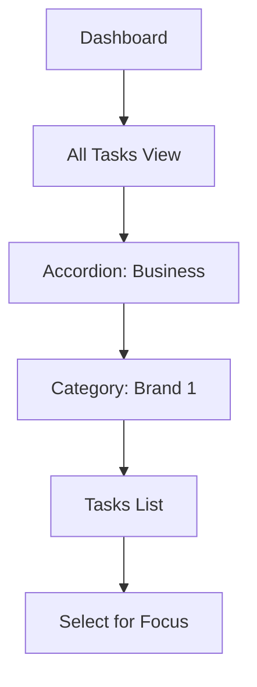

# User Flows for TodoList Web App

## Overview
This document maps the key user journeys and interactions for the TodoList app, building on @project-overview.md. It focuses on seamless navigation between task views, daily focus selection, completion logging, and hierarchical organization to address pain points like fragmented task visibility and manual planning. Flows are designed for intuitiveness, with mobile-first considerations and error handling (e.g., offline states, validation errors).

Flows are described in steps, with potential edge cases. Visualized using simple Mermaid diagrams where helpful.

## Core User Journeys

### 1. Onboarding and Initial Setup
- User lands on homepage (/).
- If not logged in: Prompt for sign-up/login (email/password or OAuth).
- Post-auth: Redirect to dashboard (/dashboard) with empty task lists and onboarding tips (e.g., "Create your first category").
- Edge: Invalid credentials → Error message with retry.

### 2. Viewing All Tasks
- From dashboard: Navigate to "All Tasks" view (/tasks/all).
- Display hierarchical accordions by headers (e.g., "Business", "Personal") and categories (e.g., "Work", "Health").
- Filter: Show incomplete tasks by default; Toggle to include completed.
- Actions: Expand/collapse sections; Search/filter by tags/priority/due date.
- Pain Point Addressed: Unified view of all tasks without switching apps.
- Edge: Empty lists → Show placeholders (e.g., "No tasks yet—add one!"); Large lists → Pagination/lazy load.

Mermaid Diagram (Simplified):

### 3. Selecting Tasks for Today's Focus
- In All Tasks view: Checkbox or button to "Add to Today's Focus" for any task.
- Updates reflected in sidebar "Today's Focus" list (/focus/today).
- Quick-add: Input field in focus list to add new tasks directly (not tied to other lists).
- Pain Point Addressed: Easy selection from any list into daily view; Ad-hoc additions.
- Edge: Duplicate selections → Prevent or warn; Offline → Queue updates.

### 4. Managing Daily Focus and Completions
- In Today's Focus: View focused, incomplete tasks; Toggle completion (checkbox → strikethrough + timestamp).
- On completion: Log to historical view (/log) with date grouping; Update stats (e.g., daily total).
- Daily Reset: On page load (or midnight cron), unflag unfinished focused tasks.
- Actions: Edit/reorder tasks; Mark incomplete to revert.
- Edge: No tasks → Motivational placeholder; Conflicts (e.g., due date passed) → Highlight warnings.

### 5. Task Creation and Editing
- From any view: "Add Task" button → Modal/form with fields (title, desc, priority, duration, due date, tags, parent task, category).
- Assign to header/category; Optional subtask linking.
- Edit: Inline or modal for existing tasks; Optimistic UI updates.
- Delete: Confirmation prompt; Immediate removal from all views.
- Edge: Validation errors (e.g., missing title) → Inline feedback; Subtask deletion → Cascade warning.

### 6. Category Management
- From settings (/settings/categories): Create/edit categories with name, color, icon, header.
- Assign tasks during creation or via drag/drop.
- Edge: Deleting category → Reassign tasks or warn.

### 7. Historical Log and Stats
- Navigate to /log: Grouped by date (e.g., "July 12, 2025 - 5 tasks completed").
- Display details: Task title, completion time, category.
- Dashboard widget: Progress bars for totals (e.g., weekly completions).
- Edge: No history → "Start completing tasks to build your log!"

### 8. Navigation and Global Elements
- Sidebar: Quick links to Dashboard, All Tasks, Today's Focus, Log, Settings.
- Search Bar: Global task search across views.
- Notifications: For due dates, resets, or errors.
- Logout: Clear session and redirect to home.

## Error Handling and Edge Cases
- Offline: Cache views with service workers; Sync on reconnect.
- Conflicts: E.g., focusing a completed task → Auto-unfocus.
- Accessibility: Keyboard navigation, ARIA labels for all interactive elements.

## Next Steps
- Use this to inform @tech-stack.md recommendations (e.g., routing for views).
- Prototype key flows in Figma for validation. 